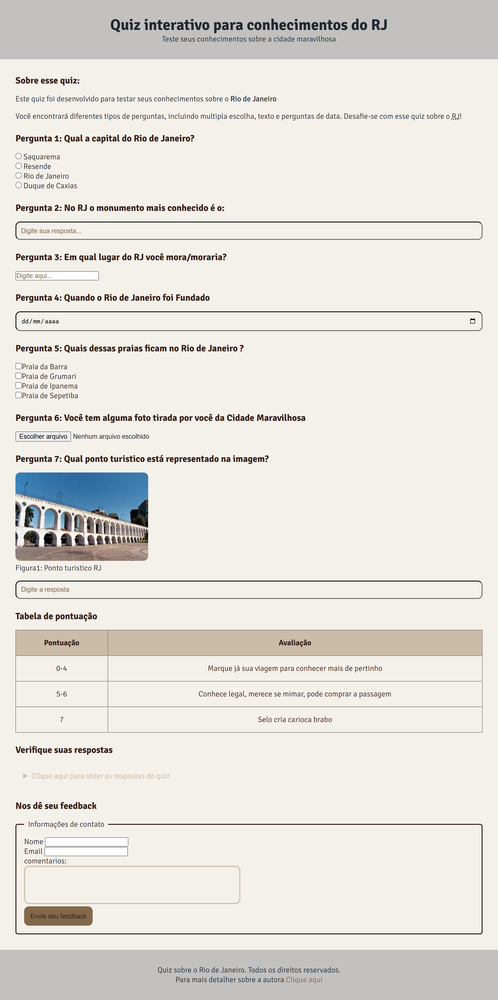

# 🌆 Quiz: Rio de Janeiro

Este projeto foi criado **do zero** com o objetivo de aplicar e consolidar meus conhecimentos em **HTML, CSS e JavaScript**. Trata-se de um quiz interativo sobre o estado do **Rio de Janeiro**, com perguntas de múltipla escolha, lógica de pontuação e feedback ao final do jogo.

🎯 Além de praticar a linguagem JavaScript, foquei na manipulação do DOM, uso de eventos e criação de uma interface leve e responsiva.

---

## ✨ Funcionalidades

- Perguntas de múltipla escolha sobre o estado do Rio de Janeiro
- Validação de respostas com contagem de acertos
- Feedback final com a pontuação do usuário
- Botão para reiniciar o quiz
- Interface responsiva e intuitiva

---

## 🛠️ Tecnologias Utilizadas

- HTML5
- CSS3
- JavaScript (Vanilla JS)

---

## 📷 Captura de Tela

<!-- Substitua com a imagem do projeto, se houver -->


---

## 🚀 Como executar localmente

1. Clone o repositório:
```bash
git clone https://github.com/juulianuness/Rio-de-Janeiro-Quiz.git
